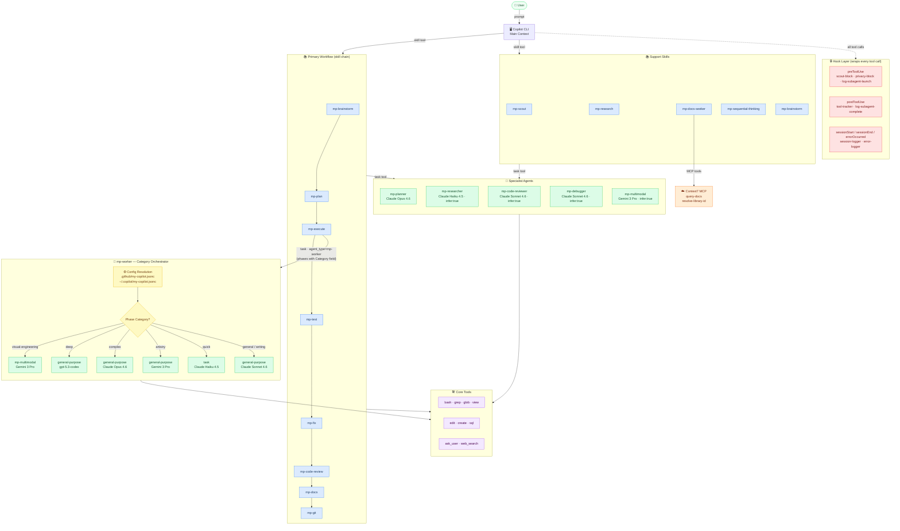

# my-copilot Flow Diagram

Visual overview of the complete my-copilot plugin workflow — skills, agents, category delegation, hooks, and tools.

```mermaid
flowchart TD
    User([👤 User]) -->|prompt| CLI["🖥️ Copilot CLI\nMain Context"]

    CLI -->|skill tool| WF
    CLI -->|skill tool| SS

    subgraph WF["📚 Primary Workflow  (skill chain)"]
        direction LR
        WF1[mp-brainstorm] --> WF2[mp-plan]
        WF2 --> WF3[mp-execute]
        WF3 --> WF4[mp-test]
        WF4 --> WF5[mp-fix]
        WF5 --> WF6[mp-code-review]
        WF6 --> WF7[mp-docs]
        WF7 --> WF8[mp-git]
    end

    subgraph SS["📚 Support Skills"]
        direction LR
        SS1[mp-scout]
        SS2[mp-research]
        SS3[mp-docs-seeker]
        SS4[mp-sequential-thinking]
        SS5[mp-brainstorm]
    end

    %% mp-execute delegates to mp-worker when phases have Category tags
    WF3 -->|"task · agent_type=mp-worker\n(phases with Category field)"| WORKER

    subgraph WORKER["🔄 mp-worker — Category Orchestrator"]
        direction TB
        CFG["⚙️ Config Resolution\n.github/my-copilot.jsonc\n~/.copilot/my-copilot.jsonc"]
        CFG --> CAT{Phase Category?}

        CAT -->|visual-engineering| C1["mp-multimodal\nGemini 3 Pro"]
        CAT -->|deep| C2["general-purpose\ngpt-5.3-codex"]
        CAT -->|complex| C3["general-purpose\nClaude Opus 4.6"]
        CAT -->|artistry| C4["general-purpose\nGemini 3 Pro"]
        CAT -->|quick| C5["task\nClaude Haiku 4.5"]
        CAT -->|"general / writing"| C6["general-purpose\nClaude Sonnet 4.6"]
    end

    %% Specialist agents (infer:true = auto-dispatched by CLI)
    subgraph SA["🤖 Specialist Agents"]
        direction TB
        SA1["mp-planner\nClaude Opus 4.6"]
        SA2["mp-researcher\nClaude Haiku 4.5 · infer:true"]
        SA3["mp-code-reviewer\nClaude Sonnet 4.6 · infer:true"]
        SA4["mp-debugger\nClaude Sonnet 4.6 · infer:true"]
        SA5["mp-multimodal\nGemini 3 Pro · infer:true"]
    end

    WF -->|task tool| SA
    SS -->|task tool| SA

    %% MCP
    SS3 -->|MCP tools| MCP["☁️ Context7 MCP\nquery-docs\nresolve-library-id"]

    %% Tools layer
    subgraph TOOLS["🛠️ Core Tools"]
        direction LR
        T1["bash · grep · glob · view"]
        T2["edit · create · sql"]
        T3["ask_user · web_search"]
    end

    SA --> TOOLS
    WORKER --> TOOLS
    WF --> TOOLS

    %% Hooks wrap every tool call
    subgraph HOOKS["🔒 Hook Layer  (wraps every tool call)"]
        direction LR
        H1["preToolUse\nscout-block · privacy-block · log-subagent-launch"]
        H2["postToolUse\ntool-tracker · log-subagent-complete"]
        H3["sessionStart / sessionEnd / errorOccurred\nsession-logger · error-logger"]
    end

    CLI -. "all tool calls" .-> HOOKS

    %% Styling
    classDef skill fill:#dbeafe,stroke:#3b82f6,color:#1e3a5f
    classDef agent fill:#dcfce7,stroke:#22c55e,color:#14532d
    classDef worker fill:#fef9c3,stroke:#eab308,color:#713f12
    classDef hook fill:#fee2e2,stroke:#ef4444,color:#7f1d1d
    classDef tool fill:#f3e8ff,stroke:#a855f7,color:#4a044e
    classDef mcp fill:#ffedd5,stroke:#f97316,color:#7c2d12
    classDef user fill:#f0fdf4,stroke:#86efac,color:#14532d

    class WF1,WF2,WF3,WF4,WF5,WF6,WF7,WF8 skill
    class SS1,SS2,SS3,SS4,SS5 skill
    class SA1,SA2,SA3,SA4,SA5 agent
    class C1,C2,C3,C4,C5,C6 agent
    class CFG,CAT worker
    class H1,H2,H3 hook
    class T1,T2,T3 tool
    class MCP mcp
    class User user
```
